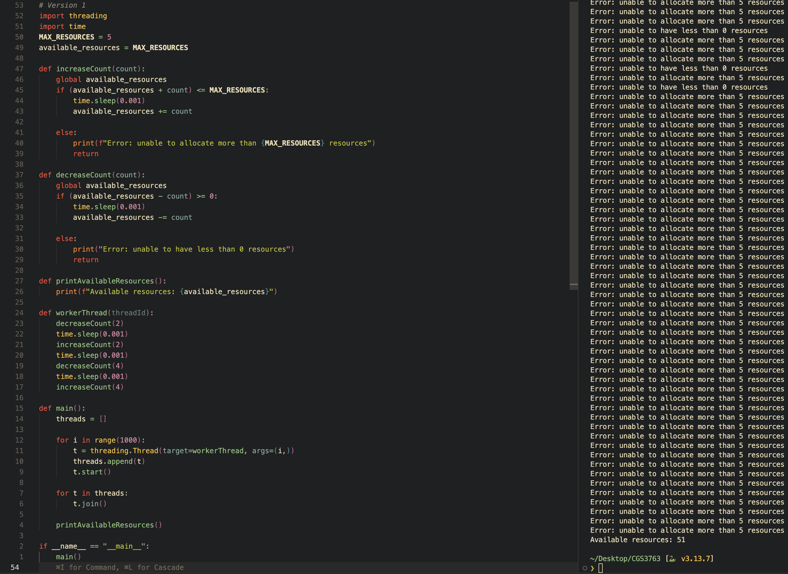
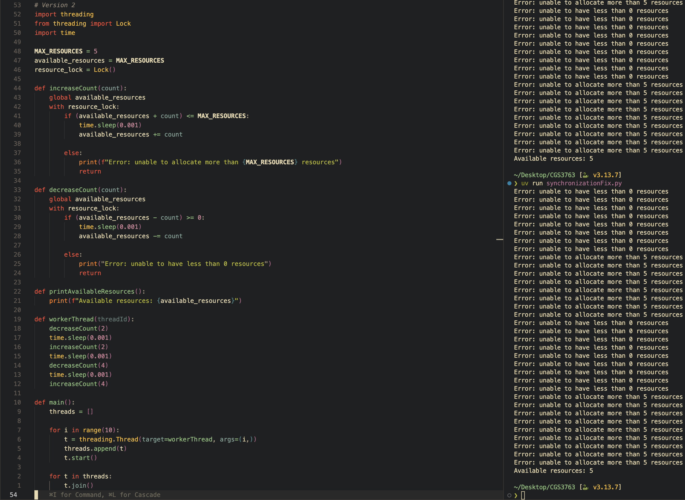
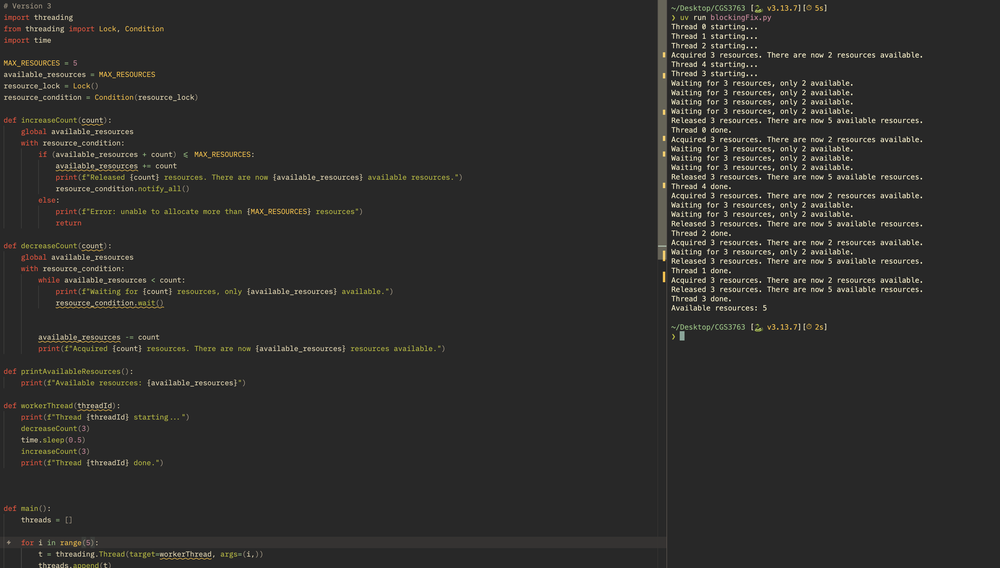

- Making the 1st version vulnerable to race condition using Python's `threading` library, since it actually achieves true parallelism using multiple threads
- In order to "remediate" this, I would rewrite the implementation of the 1st version using locks in order to lock the critical section of the code that the threads run in order to prevent race conditions.

# Basic Resource Manager (Version 1)
- This is the basic resource manager with the race condition

## 6.33a & 6.33b
For the race condition in this first scenario, it occurs in the `workerThread()` function and in the `main()` function when we start the `for` loop. All of these allocated threads start allocating & utilizing resources without any synchronization or checks for if the resources are being utilized or not. Since all of the threads are working on the same bit of data at the same time without synchronization, it causes a race condition. To fix the race condition, I used a mutex, in which I used the `Lock()` functionality from the `threading` Python library, which allows me to lock threads & only release them when there are resources available to use, mitigating the race condition.

 

# Race Condition Fix Using Mutex (Version 2)
- This is the first race condition fix using a mutex

## 6.33c
The synchronization primitive that was used was the `Lock()` function, which locks threads & prevents other threads from accessing the same data before the first thread is finished with the data.

 

# Race Condition Fix Using Thread Blocking (Version 3)
- This is the second race condition fix using a blocking thread

## 6.34
With this solution, the `Monitor` and `Condition` variables make sure that only one thread executes at a time. The `wait()` method of the `Condition` variable makes sure that it releases the lock and puts threads to sleep. The `notify_all()` method makes sure to wake up all the sleeping threads, continuing this in a cycle until all the threads properly execute without any race conditions.
